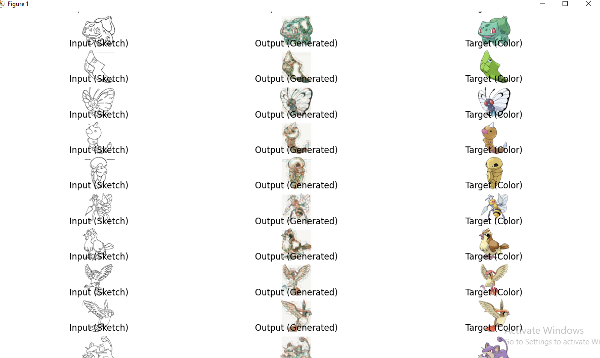

# TugasAutoencoder-DeepLearning-A-3032

## 📁 Dataset: Sketch2Photo Pokémon Dataset
Dataset ini merupakan kumpulan pasangan gambar sketsa dan gambar berwarna dari karakter Pokémon generasi awal. Dataset ini digunakan untuk tugas image-to-image translation, di mana model dilatih untuk menghasilkan gambar berwarna berdasarkan input sketsa.

### 📂 Struktur Folder Dataset
Folder utama bernama sketch2photo/, yang di dalamnya terdapat dua subfolder:
```
sketch2photo/
│
├── testA/   ← berisi gambar sketsa (grayscale)
│   ├── 0_A.jpg
│   ├── 1_A.jpg
│   ├── 2_A.jpg
│   └── ...
│
└── testB/   ← berisi gambar berwarna (target/ground truth)
    ├── 0_B.jpg
    ├── 1_B.jpg
    ├── 2_B.jpg
    └── ...
```
### 📌 Penjelasan:
- Setiap gambar pada folder testA/ adalah sketsa yang berpasangan langsung dengan gambar berwarna pada testB/ dengan indeks yang sama.

- Contoh: 3_A.jpg (sketsa) adalah pasangan input dari 3_B.jpg (gambar berwarna).

- Gambar-gambar ini digunakan dalam model autoencoder untuk belajar merekonstruksi gambar berwarna dari sketsa hitam putih.

### 🧼 Proses Preprocessing:
- Gambar pada testA/ awalnya berformat grayscale (mode='L') dan kemudian dikonversi menjadi RGB dengan menyalin channel-nya menjadi 3 (3-channel grayscale).

- Semua gambar di-resize menjadi 128x128 piksel untuk menjaga konsistensi ukuran input/output model.

- Nilai piksel diskalakan ke rentang [-1, 1]


---
## 🧠 Arsitektur Model: Convolutional Autoencoder

Model yang digunakan pada proyek ini adalah **Convolutional Autoencoder**, sebuah jenis neural network yang terdiri dari dua bagian utama: **encoder** dan **decoder**. Tujuan dari autoencoder ini adalah untuk mempelajari representasi fitur dari gambar sketsa dan kemudian merekonstruksi gambar berwarna yang sesuai.

### 🔹 Encoder

Bagian encoder bertanggung jawab untuk **mengubah gambar input berukuran 128x128x3 menjadi representasi fitur yang lebih kecil dan abstrak**. Ini dilakukan melalui lapisan konvolusi (Conv2D) dengan stride dan padding tertentu untuk mengecilkan ukuran gambar (downsampling).

Encoder terdiri dari:
- 2 buah lapisan **Conv2D**
- Setiap lapisan diikuti oleh fungsi aktivasi **ReLU**
- Output encoder merupakan representasi fitur dari input gambar

### 🔹 Decoder

Bagian decoder bertugas **mengubah representasi fitur tersebut kembali menjadi gambar berukuran asli**. Ini dilakukan dengan **ConvTranspose2D**, yang berfungsi sebagai kebalikan dari Conv2D dan memperbesar resolusi fitur (upsampling).

Decoder terdiri dari:
- 2 buah lapisan **ConvTranspose2D**
- Setiap lapisan diikuti oleh fungsi aktivasi **ReLU**, kecuali pada lapisan terakhir
- Lapisan terakhir menggunakan aktivasi **Tanh** agar output berada dalam rentang [-1, 1], sesuai preprocessing data

### 🔹 Ringkasan Alur

1. **Input**: Gambar sketsa 128x128x3 (hasil konversi dari grayscale ke RGB)
2. **Encoder**: Mengekstraksi fitur dan mengecilkan dimensi
3. **Decoder**: Meregenerasi gambar berwarna dari representasi fitur
4. **Output**: Gambar hasil prediksi (berwarna), ukuran sama dengan input

### 🎯 Tujuan

Model dilatih untuk **meminimalkan perbedaan antara gambar berwarna hasil prediksi dan gambar target asli**, menggunakan fungsi loss **Mean Squared Error (MSE)**. Dengan kata lain, model belajar mewarnai sketsa seakurat mungkin seperti target aslinya.


---
## 🎨 Contoh Input dan Output

Berikut adalah visualisasi hasil prediksi model setelah proses pelatihan:



### 📌 Penjelasan:
- **Input**: Sketsa karakter Pokémon dalam grayscale yang telah dikonversi menjadi 3 channel RGB.
- **Output**: Gambar hasil prediksi dari model Autoencoder, yang mencoba memberi warna pada gambar sketsa.
- **Target**: Gambar berwarna asli (ground truth) yang menjadi acuan selama pelatihan.

> Semua gambar telah diresize menjadi 128x128 piksel dan diskalakan ke rentang [-1, 1] selama proses training.


---
## 📉 Performa Model (Loss)
Model dilatih selama 640 epoch menggunakan MSELoss dengan optimizer Adam.

### 📈 Grafik Performa (berdasarkan log loss):
- Loss awal (epoch 20): 0.2085

- Loss akhir (epoch 640): 0.0633

- Trend: Konsisten menurun, menunjukkan model belajar semakin baik dalam menghasilkan gambar berwarna.
